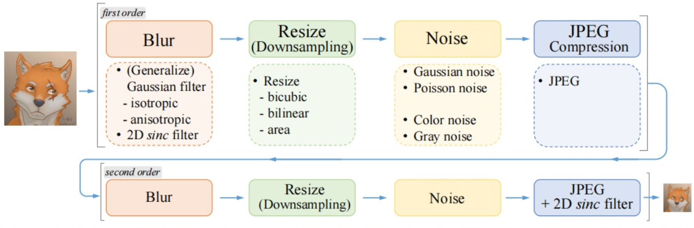

# 可微渲染新视角生成赛题：multistage NeRF

## 项目介绍

本项目为第二届计图人工智能挑战赛赛题二：可微渲染新视角生成赛题参赛作品。

可微渲染是联系二维图形与三维场景的桥梁，近年来已经在计算机视觉、计算机图形学领域引发研究新热潮。

本项目基于可微渲染，通过训练集中场景图片及对应相机参数，对场景的三维信息进行学习，最终达到生成新视角图片的目的。数据集包含5个不同的场景，每个场景有100-300张图片用于训练，20-60张图片用于验证和测试。数据集场景包含透明材质、金属材质、布料等复杂材质。

本项目的主要创新点有：

1. 提出了一种新的NeRF模型：Multistage NeRF，显著提高了NeRF模型的渲染能力
2. 充分发挥各NeRF模型的优势，基于不同场景综合效率与准确度选取最优模型和超参数策略
3. 提出了能够适配不同NeRF模型的增强渲染模型
4. 使用仿射变换、缩放、裁剪等数据增强方法，用于NeRF以及增强渲染模型的训练

## 算法介绍

### NeRF

NeRF（Neural Radiance Fields）首次提出了利用隐式表示实现照片的视角合成效果。

它的主要贡献为

* 提出了5D neural radiance field 的方法实现复杂场景的隐式表示。
* 基于体素渲染提出了一种可微渲染的流程，使用了分层抽样的策略。
* 提出了位置编码的方法，提高了网络捕捉高频信息的能力。

#### Neural Radiance Fields

Radiance Fields为一个函数 $g_\theta (x, d) = (\sigma, c)$，该函数的输入为 $x \in R^3$表示三维空间点的坐标，$d \in S^2$是观察角度，输出为$\sigma \in R$为体素密度，$c \in R^3$为RGB颜色值。

NeRF将场景表示为空间中任何点的体素密度和RGB颜色值。有了以NeRF形式存在的场景表示后，可以对该场景进行渲染，生成新视角的模拟图片。论文使用经典体积渲染的原理，求解穿过场景的任何光线的颜色，从而渲染合成新的图像。

近边界 $t_n$ 原边界$t_f$的相机光线$r(t) = o + td$的颜色$C(r)$为

$C(r) = \int_{t_n}^{t_f}T(t)\sigma (r(t))c(r(t), d)dt$

$T(t) = e^{-\int _{t_n}^t \sigma (r(s))ds}$

渲染合成一张完整的图片，就需要为通过虚拟相机的每个像素的光线计算这个积分便可以得到该像素的颜色值。

#### NeRF训练

##### 网络结构

NeRF使用了多层感知机拟合函数$g_\theta$，具体网络结构如下图：


##### 训练流程

训练NeRF的输入数据是从不同位置拍摄同一场景的图片，以及拍摄这些图片的相机位姿、相机内参，以及场景的范围。

* 先将这些位置输入MLP以产生volume density和RGB颜色值；
* 取不同的位置，使用体积渲染技术将这些值合成为一张完整的图像；
* 因为体积渲染函数是可微的，所以可以通过最小化上一步渲染合成的、真实图像之间的差来训练优化NeRF场景表示。损失函数为$L=\sum _{r \in R}[||\hat C_c(r) - C(r)||^2_2 + ||\hat C_f(r) - C(r)||^2_2]$

这样的一个NeRF训练完成后，就得到一个模型，但该模型只含有该场景的信息，不具有生成别的场景的图片的能力。

#### 分层抽样

在体素渲染方法中，对于射线上的点如何采样会影响最终的效率，如果采样点过多计算效率太低，采样点过少又不能很好地近似。NeRF很自然地提出由粗到细的分层采样方案（Coarse to Fine），对于颜色贡献大的点附近采样密集，贡献小的点附近采样稀疏。

#### 位置信息编码

论文中提到，如果直接将位置和角度作为网络的输入得到的结果是相对模糊的，这是因为神经网络倾向于学习到频率较低的函数。因此，NeRF将低维输入通过高频函数映射到高维空间，提升网络捕捉高频信息的能力。

将$F_\theta$修改为两个函数的组合，即$F_\theta = F_\theta' \circ \gamma$

其中$\gamma(p) = (sin(2^0 \pi p), cos(2^0 \pi p), \dots ,sin(2^{L-1} \pi p), cos(2^{L-1} \pi p) )$

### instant ngp(JNeRF)

Instant-NGP主要解决NeRF在对全连接神经网络进行参数化时的效率问题。

它的主要贡献为：提出了一种编码方式，使得可以使用一个较小规模的网络来实现NeRF同时不会产生精度的损失。该网络由特征向量的多分辨率哈希表实现增强，基于随机梯度下降执行优化。该方法最大的亮点是将NeRF以小时计的时间开销提升到秒级。

#### 多分辨率哈希编码的设计与实现


该图表示了利用不同分辨率的体素结构来编码点云数据的方式。红色方框表示的是分辨率较高的体素网格，蓝色方框对应的是分辨率较低的提速网格。根据网格顶点的数值以及对应的位置，可以实现对网格内部点的编码。该过程可以较快执行的原因在于整个编码过程是面向数值本身实现的，因此不需要搜索，仅需要比较计算即可实现快速精确定位与编码，并输出最终我们需要的T个L维特征向量。

#### 基于编码的神经网络训练


该方法使用了具有两个隐层的MLP，包含64个神经元（本实验中调整为128个）以及ReLU函数构建网络结构，损失和输出激活的选择是特定于任务的。当训练数据具有低动态范围(sRGB)时，我们使用sigmoid激活；当训练数据具有高动态范围(线性)时，使用指数激活（线性HDR)。

### realESRGAN

realESRGAN主要目标为解决真实场景下的图像失真问题。

其主要贡献有：

* 提出了新的构建数据集的方法，用High-order增强降阶图像的复杂度。
* 构造数据集时引入sinc filter，解决了图像中的振铃和过冲现象。
* 替换原始ESRGAN中的VGG-discriminator，使用U-Net discriminator，以增强图像的对细节上的对抗学习。
* 引入spectral normalization以稳定由于复杂数据集和U-Net discriminator带来的训练不稳定情况。

#### High-order



作者提出的High-order流程如上图。目的是使用更复杂的降级方法，更好的模拟真实世界中的低分辨模糊情况，从而达到更好的学习效果。

#### sinc filter

为了解决超分图像的振铃和过冲现象，作者提出了在构建降级模型中增加sinc filter的操作。

sinc filter在两个位置设置，一是在每一阶的模糊核k的处理中，也即在各项同性和各项异性的高斯模糊之后；二是在最后一阶的JPEG压缩时设置，其中最后一阶的JPEG和sinc filter执行先后顺序是随机的。

#### 训练

1. 先通过L1 loss，训练以PSRN为导向的网络，获得的模型称为Real-ESRNet。
2. 以Real-ESRNet的网络参数进行网络初始化，损失函数设置为 L1 loss、perceptual loss、 GAN loss，训练最终的网络Real-ESRGAN。

### VGG19（ImageNet预训练）

> 用于realESRGAN模型

#### VGG19网络结构


#### VGG19 特点

VGG19比较彻底地采用 3x3 尺寸的卷积核来堆叠神经网络，加深了整个神经网络的深度。同时，使用ReLU激活函数，提升了非线性变化的能力。

在本项目中，我们使用了ImageNet完成了VGG19的预训练。

### Multistage NeRF算法流程

1. 使用基础NeRF模型，生成训练集（与验证集）上的低质量采样图片，从而获得\<失真图片，原图片\>有标注数据集$S$；
2. 使用缩放、裁剪等方式扩展原有数据，对$S$进行数据增强；
3. 使用数据集$S$上的图片训练增强渲染模型
4. 使用基础NeRF模型+增强渲染模型两阶段生成测试集上结果

### 创新点

1. Multistage NeRF  
   我们使用jittor复现了 realESRGAN 增强渲染模型，从而实现了multistage NeRF，使用pipeline将增强渲染模型与NeRF相结合，取得了显著的效果提升。  
   其算法流程为先使用训练集训练基础NeRF模型，之后将基础NeRF模型生成的低质量图片通过旋转、缩放、剪切等方法进行数据增强。之后使用NeRF模型生成的图片与旋转、缩放、剪切后的图片作为增强渲染模型的训练集训练增强渲染模型。  
   最后先将测试集的数据输入NeRF模型，再将NeRF模型的输出输入增强渲染模型，得到最后的结果。  
   其训练流程见下图：

   

   基于以下两点考虑，没有联合训练基础NeRF模型与增强渲染模型：

   1. 单独训练基础NeRF模型和增强渲染模型能够达到更好的效果，可能是因为联合训练时，反向传播路径过长，GAN的训练方式又引入模型间gap的问题，从而导致较难训练。
   2. 联合训练时占用显存过大，超过单张RTX 3090显存(24GB)上限，训练效率变低。

2. Scene-aware Modeling  
   我们充分发挥了不同算法的优势，针对于每一个给定场景，我们选取了在该场景上表现最好的模型。  
   对于Car，我们使用了上述优化后的算法，即Multistage NeRF。对于Easyship，JNeRF无法捕捉到许多细节部分，故我们选用了NeRF。对于其他的场景，综合训练时间与结果，JNeRF表现最好，故我们都选用了JNeRF。

3. 对于不同NeRF模型的适配  
   尽管我们针对不同的场景使用了不同的基础NeRF模型，但是增强渲染模型能够适配所有的基础NeRF模型。因为增强渲染模型的输入为基础NeRF模型的低质量生成结果，输出为增强渲染后的结果，且训练过程相对独立，故该模型可以增强不同基础NeRF模型的渲染效果。

4. 仿射变换、缩放裁剪数据增强用于NeRF以及增强渲染模型  
   我们使用了数据增强方法从有限的数据产生更多的数据，增加训练样本的数量以及多样性，提升了模型的鲁棒性。

   在本项目中，一大难题为我们难以得到充足的数据来完成任务，导致某些场景渲染结果不佳。  
   我们通过仿射变换、缩放裁剪数据，**在仅使用给定训练集、测试集的前提下**，降低了模型对训练集中某些属性的依赖，从而提高模型的泛化能力，在测试集上得到了较好的结果。

### Minor changes

* 增加了原版NeRF加载模型，独立渲染图片的功能
* 增加了JNeRF训练时利用完整验证集的代码，从而降低过拟合的问题
* 编写了各场景pipeline脚本（见`./train_*.sh`

### 效果展示及实验结果


最终效果：（指标：PSNR）

| Easyship | Car | Coffee | Scar | Scarf |
|:---:|:---:|:---:|:---:|:---:|
| 23.4494 | 25.3668 | 34.7242 | 40.7106 | 29.4345 |

总分：153.6854

## 安装

### 运行环境

* 单卡GPU：GeForce RTX 3090
* Linux系统

### 安装依赖

* CUDA环境
* Python第三方库

  ```bash
  pip install -r ./requirements.txt
  ```

## 训练&推理

单卡训练可运行以下命令：

```bash
# Easyship
bash train_Easyship.sh

# Car
bash train_Car.sh

# Else
bash train_Else.sh
```

## 致谢

```txt
@article{hu2020jittor,
    title={Jittor: a novel deep learning framework with meta-operators and unified graph execution},
    author={Hu, Shi-Min and Liang, Dun and Yang, Guo-Ye and Yang, Guo-Wei and Zhou, Wen-Yang},
    journal={Science China Information Sciences},
    volume={63},
    number={222103},
    pages={1--21},
    year={2020}
}
@article{mueller2022instant,
    author = {Thomas M\"uller and Alex Evans and Christoph Schied and Alexander Keller},
    title = {Instant Neural Graphics Primitives with a Multiresolution Hash Encoding},
    journal = {ACM Trans. Graph.},
    issue_date = {July 2022},
    volume = {41},
    number = {4},
    month = jul,
    year = {2022},
    pages = {102:1--102:15},
    articleno = {102},
    numpages = {15},
    url = {https://doi.org/10.1145/3528223.3530127},
    doi = {10.1145/3528223.3530127},
    publisher = {ACM},
    address = {New York, NY, USA},
}
@inproceedings{mildenhall2020nerf,
    title={NeRF: Representing Scenes as Neural Radiance Fields for View Synthesis},
    author={Ben Mildenhall and Pratul P. Srinivasan and Matthew Tancik and Jonathan T. Barron and Ravi Ramamoorthi and Ren Ng},
    year={2020},
    booktitle={ECCV},
}
@Article{wang2021realesrgan,
    title={Real-ESRGAN: Training Real-World Blind Super-Resolution with Pure Synthetic Data},
    author={Xintao Wang and Liangbin Xie and Chao Dong and Ying Shan},
    journal={arXiv:2107.10833},
    year={2021}
}
```

> 部分代码参考自[jittor-GAN](https://github.com/Jittor/gan-jittor)开源模型库
